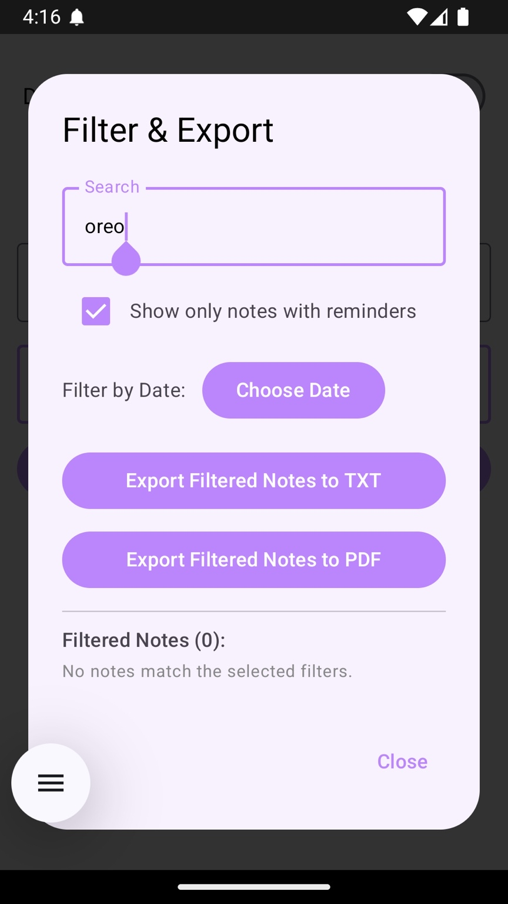

# SmartNotesApp

SmartNotesApp is a modern Android notes application that lets users add, search, edit, organize notes with reminders, snooze, calendar/date-based filtering, and export notes to TXT or PDF.  
Built with **Jetpack Compose**, **Room**, **Hilt**, **Material Design**, and **Kotlin Coroutines**—it provides a beautiful and intuitive experience for daily note-taking and productivity.

---

## ✨ **Features**

- **Add/Edit/Delete Notes**
- **Search Notes by Text**
- **Reminders & Alarm Notifications**
- **Snooze Reminders**
- **Dark/Light Theme Toggle**
- **Filter Notes by Date, Reminders, or Keywords**
- **Export Notes (TXT or PDF, filtered/all)**
- **Modern Material UI using Jetpack Compose**
- **MVVM Architecture, Room Database, Hilt Dependency Injection**

---

## 🚀 **Screenshots**

### Home Screen


### Add Reminder/Alarm


### Reminder Notification & Snooze Confirmation


### Filter & Export Dialog


### Filter by Date


### Filter Notes with Words


### Search with Reminders


### Export as PDF and TXT


---

## 🛠️ **Tech Stack**

- **Jetpack Compose** - UI toolkit
- **Room Database** - Local data persistence
- **Kotlin Coroutines & StateFlow** - Async & reactive updates
- **Hilt** - Dependency Injection
- **Material Icons Extended**
- **Accompanist** - Compose extensions
- **MVVM Architecture**

---

## 📚 **How it Works**

1. **Add or Edit Notes** — Add a title, content, and (optionally) set a reminder.
2. **Reminders** — Receive timely notifications for your notes; tap 'Snooze' to delay by 2 minutes.
3. **Filter & Export** — Tap the filter icon to filter by date, reminders, or keywords. Export filtered notes as TXT or PDF.
4. **Dark Mode** — Toggle light/dark theme.
5. **Persistent Storage** — All notes/reminders are saved in Room DB.

---

## 📝 **Getting Started**

1. **Clone the repo:**
    ```sh
    git clone https://github.com/BhavyaMarripudi-1102/SmartNotesApp.git
    ```
2. **Open with Android Studio.**
3. **Build & Run on an emulator or device.**

---

## 🤝 **Contributing**

Pull requests are welcome!  
For major changes, please open an issue first to discuss what you would like to change.

---

## 📸 **Image Credits**

All screenshots in the `Screenshots/` folder are captured from this app.

---

## 📄 **License**

This project is licensed under the [MIT License](LICENSE).

---

*Built by Bhavya Marripudi with ❤️ using Jetpack Compose!*